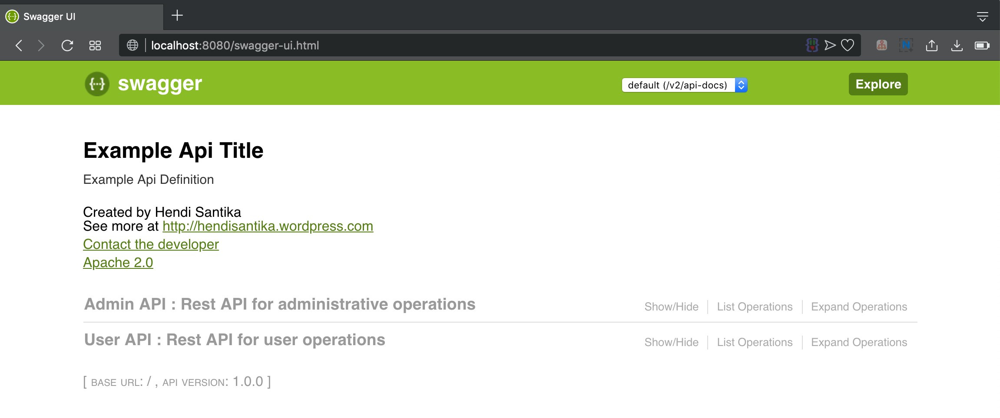
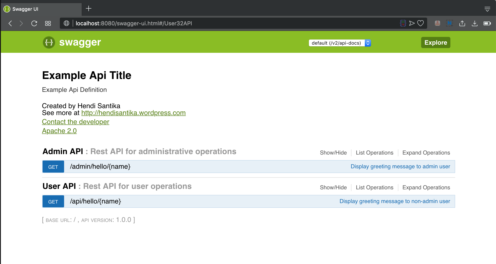
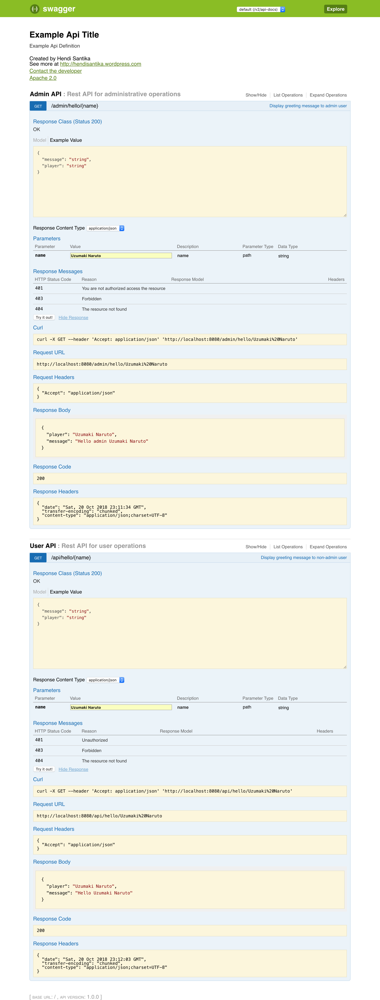

# Spring Boot Swagger Kotlin

Run this project by this command : `gradle clean bootRun`

Go to your browser and type this : http://localhost:8080/swagger-ui.html

### Screenshot

Swagger Home Page

Swagger Home Page 2

Full Details Swagger Home Page

