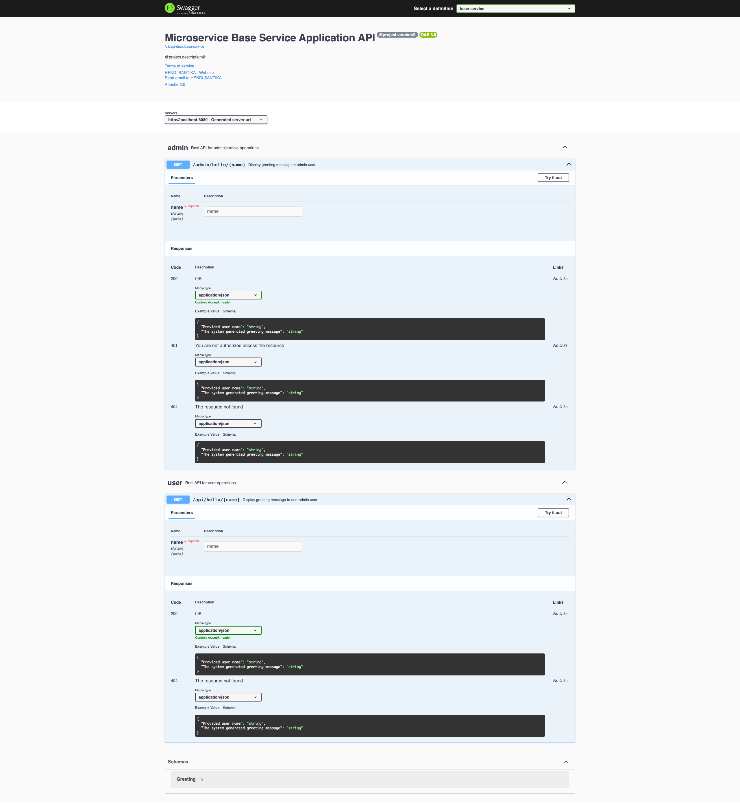

# Spring Boot Swagger Kotlin

Run this project by this command : `./gradlew clean bootRun`

Go to your browser and type this : `http://localhost:8080/swagger-ui.html`

### Screenshot

Swagger Home Page

Swagger Home Page 2

Full Details Swagger Home Page

New Swagger UI Home Page

